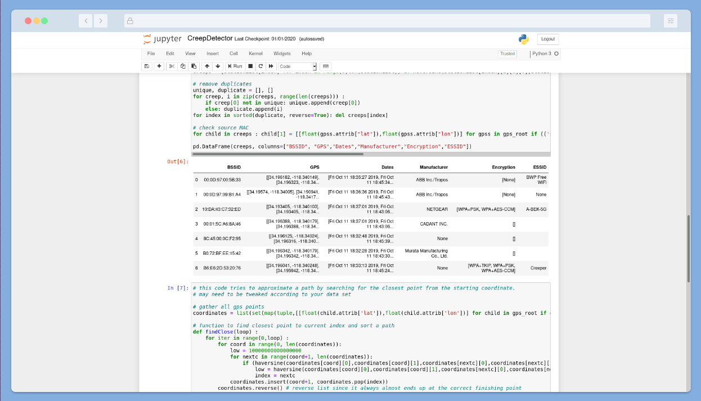
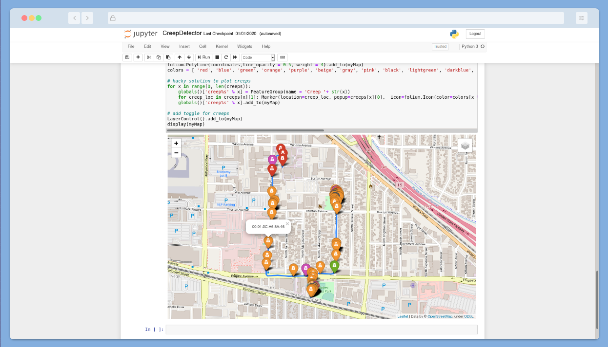

# CreepDetector
Detect stalkers using wardriving!

This Python script detects if someone is following you, by using wardriving data to determine if a unique MAC address appears at multiple locations.  This works by sniffing for Probe Requests, a type of WiFi frame that reveals networks you've joined in the past!  

## Tools
We use Jupyter Notebook for this proof-of-concept to visualize the data, and the `Folium` mapping library as well as `Pandas` for data analysis.  You can try out this example in [Google CoLab](https://colab.research.google.com)
The data capture in this demo uses [Kismet Wireless](https://www.kismetwireless.net/) on a Raspberry Pi.

## Snapshots

  
   
  <b>Creep list generated in Jupyter Notebook</b>
   
   
  
   
  <b>Rendered Creep map with Folium</b>
   
   

## Documentation
[Detecting Stalkers over Wi-Fi Episode](https://www.youtube.com/watch?v=wNke7teywOs)  
[Alex's Code Breakdown Episode](https://youtu.be/ug9dHwm3h0s)  
